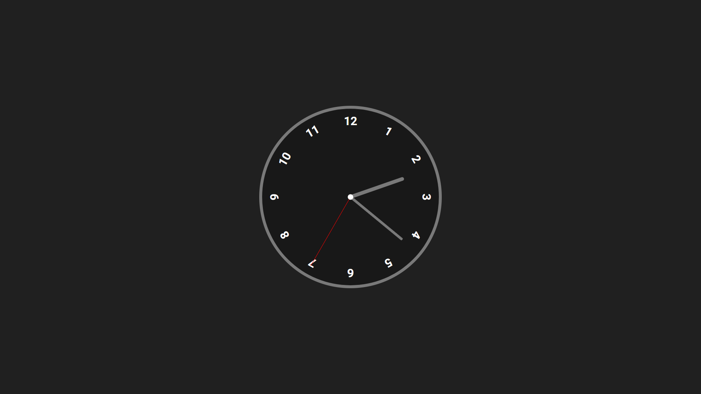

<h1>
Analog Clock
</h1>

<h1>
    
</h1>

## 🧾 Sobre

Um simples relógio analógico funcional que identifica o horário atual do usuário. Este projeto foi realizado com o intuito de colocar em prática os estudos realizados e adquirir experiências com as tecnologias.

## 💻 Tecnologias utilizadas

- HTML
- CSS
- JavaScript

## 📚 Tutorial

A realização do projeto só foi possível com a ajuda do seguinte vídeo:

https://www.youtube.com/watch?v=Ki0XXrlKlHY&ab_channel=WebDevSimplified
